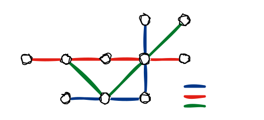
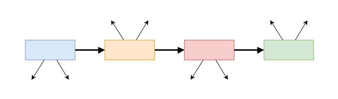
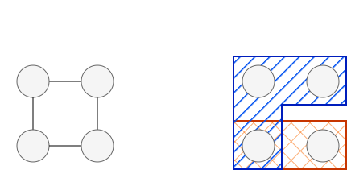
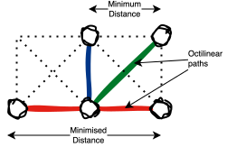
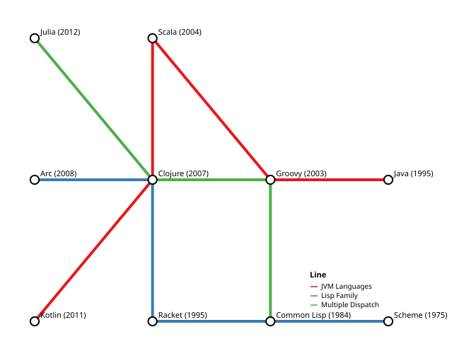

::: callout-important
## Clojure Jam Proposal - Article Draft

This is a draft article proposed for presentation at [Clojure Jam 2026](https://scicloj.github.io/clojure-jam-2026/). Further work to be done on the article includes:

- Porting to a Clay notebook. Work on this is underway, but planned interactive Quarto elements need to be checked.
- Finalising the article; there is some further work to write up around avoiding overlapping edges and through routing.
- Refinements and extensions to the writing and code, further testing, as well as more explanatory, animated diagrams and interactive embedded plots.

Whilst the article stands alone, there is also a separate [EPL 2.0](https://www.eclipse.org/legal/epl-2.0/) licensed tool ([Memame](https://github.com/wlkr/memame)) under active development, building on the concepts in this article and due to be released alongside the published version. Memame provides a more production-ready version of the code here, as well as additional features and bindings for other languages.

Feedback is most welcome! -- Adam
:::

## Overview

Metro map metaphors are a powerful technique for representing multi-dimensional relationships using a familiar, intuitive visual language, inspired by the design of schematic transportation metro maps (also known as subway, tube, and transit maps). Unlike the prototypical tube map, which approximates the real-world geographic layout of stations and lines, metro map metaphors are abstract visual representations of relationships between entities. Metro map metaphors can capture multiple dimensions of data simultaneously, with stations representing entities and optionally ordered lines representing relationships or shared features. The spatial arrangement of stations and lines can also be exploited to capture a further one or two dimensions, such as time, hierarchy, similarity, magnitude, structure, and so on. @fig-metro-map-example shows a sketch of a metro map metaphor for programming languages, with stations representing programming languages and lines representing shared features or paradigms.

{#fig-metro-map-example fig-alt="Example metro map metaphor for programming languages." width="600"}

The work in this article forms the basis for [Memame](https://github.com/wlkr/memame), a library for generating metro map metaphors in Clojure using the [oj! Algorithms](https://www.ojalgo.org/) optimisation library and the [Vega](https://vega.github.io/vega/) visualisation grammar. Memame, and by extension this article, does not claim novelty in the mathematical formulation of the problem, development of the solver, or the underlying visualisation library. The intention is to provide an extensible toolkit by bringing these together to make it easier to produce metro map metaphor visualisations directly from Clojure. The code in this article is a simplified version of the code in Memame, intended to illustrate the core pipeline and underlying techniques used. In addition to [Clojure](https://clojure.org/), the tooling used in this article includes:

- [oj! Algorithms](https://www.ojalgo.org/): A pure Java, [MIT licensed](https://opensource.org/license/mit) library with support for optimisation, including [mixed-integer programming (MIP)](https://en.wikipedia.org/wiki/Integer_programming), used here for layout generation.
- [Vega](https://vega.github.io/vega/): A declarative visualisation grammar for presenting the generated metro map metaphor.

As highlighted in @fig-metro-map-pipeline, we can broadly group the process of transforming data into a metro map metaphor visualisation into four stages: (i) initial data processing, (ii) model formulation, (iii) solving, and (iv) visualisation. The model formulation is based on the works of Nöllenburg and Wolff [@nöllenburg2006].

{#fig-metro-map-pipeline fig-alt="Metro map metaphor generation pipeline." width="700"}

Before continuing, it's also worth briefly introducing some terminology at this point and reminding ourselves of some graph theory we might not have looked at for a while. A [graph](https://en.wikipedia.org/wiki/Graph_(discrete_mathematics)) $G$ is a pair comprising a set of vertices and edges, $G = (V, E)$. Vertices are stations in metro map lingo, and stations are connected by edges; edges connect pairs of stations. A [hypergraph](https://en.wikipedia.org/wiki/Hypergraph) extends the notion of a graph so that edges can be connected to many vertices in a hyperedge, i.e., edges go from being a pair to a subset of $V$. One possible way to draw the edge between these vertices is the line that connects them on a metro map. The stations along a line represent that hyperedge. Hyperedges do not inherently have order, and we'll slightly misuse the term in this article to mean a directed, ordered hyperedge. @fig-graph-comparison visually shows the difference between a graph and a hypergraph.

{#fig-graph-comparison fig-alt="Graph vs hypergraph comparison." width="500"}

## Prior Art

This is not an exhaustive literature review, but a selection of prior work in this area for context and to present areas of further reading and exploration. Metro map metaphors are not a new area of research, and digital use of metro map metaphors has been around for a long time. A nice example from 2001 demonstrates the use of a digital metro map metaphor in the Webvise Guided Tour System.

MetroSets [@jacobsen2021] is a web-based tool for visualising hypergraphs using metro map metaphors. A key distinction between MetroSets and many other metro map metaphor visualisation tools (including Memame) is that MetroSets supports hyperedges in the true sense of the term, as an unordered set of vertices. The deployment of [MetroSets](https://metrosets.ac.tuwien.ac.at/) available on the web is built heavily on Python libraries. Porting elements of the elegant MetroSets pipeline to Memame is a target of future functionality enhancements.

todo: complete

## Data Representation

For ease of integration with Clojure, we use an [EDN](https://github.com/edn-format/edn) hypergraph representation for metro map metaphors, so that Graphs can be loaded straightforwardly from EDN files using [`clojure.edn/read-string`](https://clojuredocs.org/clojure.edn/read-string). The example used throughout this article is a small metro map metaphor for programming languages, shown earlier in @fig-metro-map-example. Each vertex represents a programming language (Clojure, Java, etc.), and each hyperedge represents a shared feature or paradigm:

- `:jvm`: Java Virtual Machine (JVM) languages
- `:lisp`: Lisp family of languages
- `:multiple-dispatch`: Languages supporting multiple dispatch

``` clojure
(def hypergraph
  {:vertices
   {:scheme      {:label "Scheme (1975)"}
    :common-lisp {:label "Common Lisp (1984)"}
    :racket      {:label "Racket (1995)"}
    :java        {:label "Java (1995)"}
    :groovy      {:label "Groovy (2003)"}
    :scala       {:label "Scala (2004)"}
    :clojure     {:label "Clojure (2007)"}
    :arc         {:label "Arc (2008)"}
    :kotlin      {:label "Kotlin (2011)"}
    :julia       {:label "Julia (2012)"}}
   :hyperedges
   {:jvm
    {:label    "JVM Languages"
     :vertices [:java :groovy :scala :clojure :kotlin]}
    :lisp
    {:label    "Lisp Family"
     :vertices [:scheme :common-lisp :racket :clojure :arc]}
    :multiple-dispatch
    {:label    "Multiple Dispatch"
     :vertices [:common-lisp :groovy :clojure :julia]}}})
```

To apply layout rules to the hypergraph and generate the metro map visualisation, we first need to derive the underlying support graph. The support graph in this case consists of unordered edges between adjacent vertices along each ordered hyperedge. For instance, `:jvm` contains the vertices `:java`, `:groovy`, `:scala`, `:clojure`, and `:kotlin`. The support graph includes edges between each pair of adjacent vertices along this hyperedge.

``` clojure
(defn support-graph
  "Extend `hypergraph` with edges derived from its hyperedges."
  [{hyperedges :hyperedges :as hypergraph}]
  (assoc
   hypergraph
   :edges
   (->>
    hyperedges
    ;; derive pairs of edges to hyperedge keys from consecutive vertices
    (mapcat
     (fn [[h {v :vertices}]]
       (map #(vector % h) (->> v (partition 2 1) (map set)))))
    ;; collect edge pairs into a map of edges to a set of hyperedge keys
    (reduce
     (fn [m [e h]] (update m e (fnil conj #{}) h))
     {}))))
```

Calling `(support-graph hypergraph)` extends the hypergraph map with an `:edges` key, the value of which is a map of unordered edges to the set of hyperedges that contain them.

``` clojure
{#{:clojure :racket}     #{:lisp}
 #{:clojure :kotlin}     #{:jvm}
 #{:common-lisp :scheme} #{:lisp}
 #{:common-lisp :groovy} #{:multiple-dispatch}
 #{:arc :clojure}        #{:lisp}
 #{:clojure :julia}      #{:multiple-dispatch}
 #{:scala :clojure}      #{:jvm}
 #{:scala :groovy}       #{:jvm}
 #{:java :groovy}        #{:jvm}
 #{:common-lisp :racket} #{:lisp}
 #{:clojure :groovy}     #{:multiple-dispatch}}
```

## Layout Formulation

### Formulation Overview

As indicated earlier, the layout process in this section revolves around formulating the problem as a mixed-integer programming (MIP) problem using the Nöllenburg and Wolff formulation [@nöllenburg2006], subsequently employing the [oj! Algorithms](https://www.ojalgo.org/) MIP optimiser to find an optimal (or at least feasible) solution. The rule formulation is not at all novel to this work, and quite on the contrary, there is a lot of very interesting research that explores various aspects of this. MIP is one of the most popular techniques for metro map (and metro map metaphor) layout generation, although it is not always an especially fast process! Here, we include just a few core rules to achieve a reasonable layout for a small example. In this section, we'll just take a brief look at the underlying rules we plan to include. This is also a bit of a refresher on MIP, in case it's not something you've worked with for a while. As illustrated in @fig-metro-map-rules, the rules we implement in this article are as follows:

- **Octilinearity**: Ensure that edges lie along one of four octilinear directions (horizontal, vertical, positive diagonal, negative diagonal) to obtain the characteristic metro map aesthetic.
- **Minimum Edge Gap**: Prevent vertices connected by an edge from being collapsed together by enforcing a minimum distance between them.
- **Vertex Separation**: Require that all vertices not connected by an edge are at least a certain distance apart.
- **Minimum Edge Length**: Minimise the length of edges to encourage a compact layout.

{#fig-metro-map-rules fig-alt="Overview of Metro Map Metaphor MIP rules." width="400"}

### Octilinearity

For octilinearity, each edge must lie in *exactly one* of four directions: horizontal ($0^\circ$), vertical ($90^\circ$), positive diagonal ($45^\circ$), or negative diagonal ($135^\circ$). One of the following must hold:

- $y_a - y_b = 0$: Vertices $a$ and $b$ are horizontally aligned.
- $x_a - x_b = 0$: Vertices $a$ and $b$ are vertically aligned.
- $y_a - y_b = x_a - x_b$: Vertices $a$ and $b$ are aligned along a positive diagonal (gradient of $1$).
- $(y_a - y_b) = x_b - x_a$: Vertices $a$ and $b$ are aligned along a negative diagonal (gradient of $-1$).

Nöllenburg and Wolff provide a nice explanation of octilinearity constraints [@nöllenburg2006]. In a nutshell, the approach uses the [Big M method](https://en.wikipedia.org/wiki/Big_M_method), and therefore introduces binary variables (here, $z_0$, $z_1$, $z_2$, $z_3$) which act as 'switches' to indicate which of the four directions applies to a given edge. An artificial 'big' constant $M$ is used to relax the constraints when the corresponding binary variable is not active. The combination of $z$ and $M$ allows us to enforce that exactly one of the four directional constraints holds for each edge. For Memame, $M$ is calculated based on the supplied `bounds` as the total span across all axes, where $u$ and $l$ are the upper and lower bounds for each axis.

$$M = \sum_{d \in D} (u_d - l_d)$$

As an example, for the horizontal case, a binary variable $z_0$ is introduced that indicates whether horizontal alignment is chosen. When $z_0$ is $1$, the constraint $y_a - y_b = 0$ is enforced. When $z_0$ is $0$, this constraint is relaxed by the large constant $M$ to make it effectively meaningless. This constraint can be expressed as two inequalities.

$$\begin{aligned}
y_a - y_b + M \cdot z_0 & \leq M \\
y_a - y_b - M \cdot z_0 & \geq -M \\
\end{aligned}$$

The sum of the binary variables for each edge is constrained to be exactly $1$ to ensure that exactly one direction is chosen.

$$z_0 + z_1 + z_2 + z_3 = 1$$

### Minimum Edge Gap

A MIP solver could trivially satisfy octilinearity constraints by placing vertices connected by an edge at the same location. To enforce space between connected vertices, the minimum edge gap rule requires that at least one of the following separation conditions must hold for each edge, where $\delta$ is the minimum gap:

- $x_a - x_b \geq \delta$: Vertex $a$ is at least $\delta$ to the right of $b$.
- $x_a - x_b \leq -\delta$: Vertex $a$ is at least $\delta$ to the left of $b$.
- $y_a - y_b \geq \delta$: Vertex $a$ is at least $\delta$ above $b$.
- $y_a - y_b \leq -\delta$: Vertex $a$ is at least $\delta$ below $b$.

Unlike octilinearity, which requires *exactly one* direction to be chosen, the minimum edge gap uses *at least one* semantics. This is because a pair of vertices separated along a diagonal will satisfy both the horizontal and vertical gap conditions simultaneously, and we do not want to exclude such valid layouts. The Big M formulation is the same as for octilinearity, but the sum over the binary indicator variables is constrained to be $\geq 1$ rather than $= 1$. In the rule definition below, $\delta = 2$.

### Vertex Separation

The minimum edge gap rule only applies to vertices that share an edge. Vertex separation handles the complementary case wherein vertices that are *not* connected by an edge must also be kept apart to avoid overlapping stations. The constraint is structurally identical to the minimum edge gap rule, applying the same four separation conditions with the same formulation.

### Minimum Edge Length

Each of the preceding rules is a hard constraint that *must* be satisfied for a layout to be considered valid. Conversely, minimum edge length is a soft constraint that is not strictly required to be satisfied, but is instead something we want to encourage the solver to satisfy. For each edge $(a, b)$, we want the solver to keep connected vertices as close together as possible by minimising the total horizontal and vertical distance between them. The weight parameter $w$ can be used to control the strength of this soft constraint relative to the hard constraints. The objective function to be minimised is as follows:

$$\min \sum_{(a,b) \in E} w \left( |x_a - x_b| + |y_a - y_b| \right)$$

Since absolute values can not be directly expressed, a variable $t$ is introduced that represents the absolute difference between $x_a$ and $x_b$, and add constraints to ensure that $t$ is greater than or equal to both $x_a - x_b$ and $x_b - x_a$ (the same applies to the $y$ coordinates):

- $t \geq 0$: $t$ must be non-negative to represent the absolute difference.
- $t \geq x_a - x_b$: $t$ is greater than or equal to the positive difference.
- $t \geq x_b - x_a$: $t$ is greater than or equal to the negative difference.

This works because the case where the resulting difference is negative is effectively ignored (it's trivially satisfied by being less than or equal to zero). The case where the difference is positive is then minimised.

## Layout Implementation

### Initialisation

To implement the above rules practically and solve them using the oj! Algorithms solver, we need to translate our hypergraph and rules into an optimisation model, defining decision variables, constraints, and an objective function that captures the rules we want to enforce. Within ojAlgo, we will use the [`ExpressionsBasedModel` class](https://generated.ojalgo.org/org/ojalgo/optimisation/ExpressionsBasedModel.html) API to programmatically build up our optimisation model. Our Clojure functions at this point are essentially wrappers around this API for our context. Instantiating the model is simple, and we'll come back to the objective function later. The first challenge is to add variables to the model for each vertex in the hypergraph and for each axis. Before we can do this, however, we need to define the axes and bounds for our variables. In this example, we are working with a two-dimensional visualisation, so we have two axes: `:x` and `:y`.

``` clojure
(def bounds
  {:x {:lower 0 :upper 10}
   :y {:lower 0 :upper 10}})
```

It's worth noting that vertex bounds are required to be specified up front as part of variable initialisation. These bounds arguably could have been expressed as a mandatory first rule, rather than being required as a separate argument. However, bounds here define the variable domain, i.e., which axes exist and the integer range for each. This is a prerequisite to the rule compiler, as variables must exist before rules can reference them, so they would need to be lifted out of the rules structure earlier in the pipeline than other rules. We also follow [oj! Algorithms guidance](https://github.com/optimatika/ojAlgo/wiki/Optimisation-Modelling-Advice) around setting properties directly on variables rather than creating single-variable expressions. The actual size of the bounds should be large enough to allow for a solution to be found, but not so large as to make the search space unnecessarily large. The somewhat arbitrary choice of bounds here was based on the size of the sketched-out example graph, but rough heuristics could be used, such as the maximum possible path length. It is worth noting that large bounds can have a negative impact on solver performance.

The `initialise-variables!` function adds $N = |V| \cdot d$ decision variables to the model. These are the *unknown quantities*, the coordinates of each vertex that the solver will determine. For each vertex, we have $d$ variables representing the coordinates of that vertex in $d$-dimensional space. In the most conventional case of a two-dimensional (2D) visualisation, we therefore have $2|V|$ decision variables. In our programming language example, this gives us $20$ decision variables. Taking the vertex `:clojure` as an example, we have the variables $x_{\text{clojure}}$ and $y_{\text{clojure}}$ representing the $x$ and $y$ coordinates of vertex `:clojure` in the visualisation. These are constrained by the `bounds`, as discussed below: $0 \leq x_{\text{clojure}} \leq 10$ and $0 \leq y_{\text{clojure}} \leq 10$. The same applies to all the other vertices.

``` clojure
(defn initialise-variables!
  "Add variables for each `hypergraph` vertex to the `model` with `bounds`."
  [model hypergraph bounds]
  (reduce-kv
   (fn [vars vertex _data]
     (assoc
      vars vertex
      (reduce-kv
       (fn [m axis {:keys [lower upper]}]
         (assoc
          m axis
          (doto (.addVariable model (str (name axis) "_" (name vertex)))
            (.integer true)
            (.lower lower)
            (.upper upper))))
       {}
       bounds)))
   {}
   (:vertices hypergraph)))
```


### Rule Definitions

Once the variables are initialised, we can start to add constraints to the model based on the rules we want to enforce. Rather than hard-coding rules as functions, we choose to encode rules as data in an EDN format. This flexibility allows for rules to be extended, adapted, and stacked to facilitate many different custom layout constraints. Each rule is represented as a map.

| Key      | Description |
|----------|-------------|
| `:rule`  | Unique custom keyword rule name. |
| `:scope` | The scope of impact for the rule. |
| `:spec`  | The specification of the rule. |

: Memame Rule Structure

Before we look at rule handling, it's worth seeing how our four rules are defined in data. We can see that the `:spec` for each rule includes a `:type` key, which indicates how the rule should be applied to the model. The `:options` key contains a vector of options that specify the constraints for each rule. The `:expr` key within each option defines the expression for the constraint, and the `:lower`, `:upper`, or `:equals` keys specify the bounds for the constraint.

Octilinearity:

```clojure
(def rule-octilinearity
  {:rule  :octilinearity
   :scope {:over :edges}
   :spec  {:type :one-of
           :options
           [{:expr {[:first :y]  1 [:second :y] -1} :equals 0}
            {:expr {[:first :x]  1 [:second :x] -1} :equals 0}
            {:expr {[:first :x]  1 [:second :x] -1
                    [:first :y] -1 [:second :y]  1} :equals 0}
            {:expr {[:first :x]  1 [:second :x] -1
                    [:first :y]  1 [:second :y] -1} :equals 0}]}})
```

Minimum edge gap and vertex separation:

```clojure
(def rule-min-edge-gap
  {:rule  :min-edge-gap
   :scope {:over :edges}
   :spec  {:type :any-of
           :options
           [{:expr {[:first :x] 1 [:second :x] -1} :lower  2}
            {:expr {[:first :x] 1 [:second :x] -1} :upper -2}
            {:expr {[:first :y] 1 [:second :y] -1} :lower  2}
            {:expr {[:first :y] 1 [:second :y] -1} :upper -2}]}})

(def rule-vertex-separation
  (assoc rule-min-edge-gap
         :rule :vertex-separation
         :scope {:over :non-edges}))
```

Minimum edge length:

``` clojure
(def rule-min-edge-length
  {:rule  :min-edge-length
   :scope {:over :edges}
   :spec  {:type :minimise
           :exprs [{[:first :x] 1 [:second :x] -1}
                   {[:first :y] 1 [:second :y] -1}]
           :weight 1.0}})
```

Our combined ruleset is simply a vector of these individual rules.

```clojure
(def rules
  [rule-octilinearity
   rule-min-edge-gap
   rule-vertex-separation
   rule-min-edge-length])
```

### Rule Handling

Rule handling is a two step process. The `enumerate` multi-method handles collection of pairs of edges.

``` clojure
(defmulti enumerate
  "Return vertex-pair maps from `graph`, dispatching on `(:over scope)`."
  (fn [_graph scope] (:over scope)))
```

The `apply!` multi-method translates a rule spec into constraints, updating the initialised ojAlgo model.

``` clojure
(defmulti apply!
  "Apply `spec` to the model in `context` for the given `bindings`.]
  (fn [_context _bindings spec] (:type spec)))
```

Looking more closely at the `apply!` multi-method, we can see that we are dispatching on the `:type` of the rule specification, allowing for different rules to have different logic for translating the rule specification into constraints on the model. The `:any-of` and `:one-of` types are used for rules that require Big M constraints, such as octilinearity and minimum edge gap. The `add-option-constraints!` function is a helper that generates Big M constraints based on the options specified in the rule. It's not an especially pretty function, arguably rather horrific, but for the time being we'll chalk that up to the complexity of the Big M formulation and needing to directly manipulate the ojAlgo model.

``` clojure
(defn- add-option-constraints!
  "Emit Big-M indicator constraints from `context`, `bindings`, and `spec`."
  [{:keys [model variables bounds]} bindings {:keys [options rule m]}]
  (let [pair (str (name (:first bindings)) "_" (name (:second bindings)))
        tag  (name rule)
        m    (or m (transduce (map #(- (:upper %) (:lower %))) +
                              (vals bounds)))
        sum  (.addExpression model (str tag "_sum_" pair))]
    (letfn [(set-coefficients! ;; set coefficients for expression variables
              [cstr variables bindings expr]
              (doseq [[[pos axis] coeff] expr]
                (.set cstr (get-in variables [(bindings pos) axis]) coeff)))
            (emit! [i expr z value suffix coeff bound!]
              (doto (.addExpression model (str tag "_opt_" i suffix pair))
                (bound! (+ value coeff))
                (.set z coeff)
                (set-coefficients! variables bindings expr)))]
      ;; create a binary indicator z and add it to the sum for each option
      (doseq [[i {e :expr l :lower u :upper}]
              (->> options
                   (map (fn [{:keys [equals] :as opt}]
                          (cond-> opt equals
                                  (-> (dissoc :equals)
                                      (assoc :lower equals :upper equals)))))
                   (map-indexed vector))]
        (let [z (.addVariable model (str tag "_z_" i "_" pair))]
          (.binary z)
          (.set sum z 1)
          (when l (emit! i e z l "_low_"  (- m) #(.lower %1 %2)))
          (when u (emit! i e z u "_high_"    m  #(.upper %1 %2)))))
      sum)))
```

Both `:any-of` and `:one-of` can be defined using the `add-option-constraints!` function. The former sets a lower bound to ensure that at least one option is chosen, while the latter sets an upper bound to enforce that at most one option is chosen.

``` clojure
(defmethod apply! :any-of
  [context bindings spec]
  (doto (add-option-constraints! context bindings spec)
    (.lower 1)))

(defmethod apply! :one-of
  [context bindings spec]
  (doto (add-option-constraints! context bindings spec)
    (.lower 1)
    (.upper 1)))
```

The `:minimise` method is much more readable (if a little verbose), as it does not require Big M constraints. For each expression in the rule, it introduces a magnitude variable constrained to be at least as large as the expression in both directions (capturing the absolute value, as described above). This magnitude variable is then added to the objective function with the specified weight, so the solver is encouraged to drive it down.

```clojure
(defmethod apply! :minimise
  [{:keys [model variables]} bindings {:keys [exprs rule weight]}]
  (doseq [[i expression] (map-indexed vector exprs)]
    (let [expr-name (str (name rule) "_magnitude_" (name (:first bindings)) "_"
                         (name (:second bindings)) "_" i)
          magnitude (.addVariable model expr-name)
          expr-pos  (.addExpression model (str expr-name "_positive"))
          expr-neg  (.addExpression model (str expr-name "_negative"))]
      (.lower magnitude 0)
      (.weight magnitude weight)
      (.set expr-pos magnitude 1)
      (.set expr-neg magnitude 1)
      (doseq [[[position axis] coefficient] expression]
        (let [v (get-in variables [(get bindings position) axis])]
          (.set expr-pos v (- coefficient))
          (.set expr-neg v coefficient)))
      (.lower expr-pos 0)
      (.lower expr-neg 0))))
```

### Solving

As with much of the code here that has been condensed for brevity, within Mememe, this solve function is split into separate steps for model instantiation, rule compilation, and solving. This separation allows for more flexibility, such as inspecting or modifying the model before solving, or critically, for testing the rule compilation process in isolation from the solve process. Still, the `solve!` function here works through the process correctly, taking a hypergraph, a sequence of rules, bounds, and solver options. After initialising the model and variables, rules are compiled into model constraints, specified solver options are applied, and finally, the model is solved, and the vertex coordinates from the solution are extracted and merged back into the hypergraph vertices.

```clojure
(defn solve! [graph rules bounds options]
  "Solve for `graph` with `rules` and `bounds`, using model `options`."
  (let [model   (ExpressionsBasedModel/new)
        vars    (initialise-variables! model graph bounds)
        context {:model model :graph graph :variables vars :bounds bounds}]
    (doseq [{:keys [rule scope spec]} rules
            bindings (enumerate graph scope)]
      ;; compile the rules into model constraints
      (apply! context bindings (assoc spec :rule rule)))
    ;; set any specified solver options on the model
    (let [opts (.options model)]
      (doseq [[k v] options]
        (clojure.lang.Reflector/setInstanceField
         opts (-> k name munge) v)))
    ;; solve the model and extract vertex coordinates from the solution
    (let [state (.getState (.minimise model))]
      (when-not (or (.isOptimal state) (.isFeasible state))
        (throw (ex-info "Solve failed." {:state (str state)})))
      ;; merge solved coordinates into hypergraph vertices
      (->> (update-vals vars #(update-vals % (fn [v] (long (.getValue v)))))
           (update graph :vertices (partial merge-with merge))))))
```

Solving the model with sufficient time to run `(solve! hypergraph rules bounds {})` yeilds an output like the following:

```clojure
(def hypergraph
  {:vertices
   {:scala       {:label "Scala (2004)"       :x 2 :y 4}
    :arc         {:label "Arc (2008)"         :x 0 :y 4}
    :common-lisp {:label "Common Lisp (1984)" :x 4 :y 6}
    :clojure     {:label "Clojure (2007)"     :x 2 :y 2}
    :julia       {:label "Julia (2012)"       :x 2 :y 0}
    :java        {:label "Java (1995)"        :x 6 :y 4}
    :racket      {:label "Racket (1995)"      :x 2 :y 6}
    :kotlin      {:label "Kotlin (2011)"      :x 4 :y 2}
    :scheme      {:label "Scheme (1975)"      :x 6 :y 6}
    :groovy      {:label "Groovy (2003)"      :x 4 :y 4}}
   :hyperedges
   {:jvm
    {:label    "JVM Languages"
     :vertices [:java :groovy :scala :clojure :kotlin]}
    :lisp
    {:label    "Lisp Family"
     :vertices [:scheme :common-lisp :racket :clojure :arc]}
    :multiple-dispatch
    {:label    "Multiple Dispatch"
     :vertices [:common-lisp :groovy :clojure :julia]}}
   :edges
   {#{:clojure :racket}     #{:lisp}
    #{:clojure :kotlin}     #{:jvm}
    #{:common-lisp :scheme} #{:lisp}
    #{:common-lisp :groovy} #{:multiple-dispatch}
    #{:arc :clojure}        #{:lisp}
    #{:clojure :julia}      #{:multiple-dispatch}
    #{:scala :clojure}      #{:jvm}
    #{:scala :groovy}       #{:jvm}
    #{:java :groovy}        #{:jvm}
    #{:common-lisp :racket} #{:lisp}
    #{:clojure :groovy}     #{:multiple-dispatch}}})
```

It's important to be aware that finding an optimal layout, even for this example, is slow! Our small programming language hypergraph has just 10 vertices and 3 hyperedges. This expands to 11 edges in the support graph, and 34 non-edges; with our ruleset, the model has 266 variables `(.countVariables model)` and 368 expressions `(.countExpressions model)`. On both a decent recent Intel CPU and a current MacBook Pro, the solve time is on the order of many minutes, rather than seconds. There are three main strategies for improving solve time:

1. **Relaxing Optimality**: Instead of insisting on an optimal solution, we can set a time limit for the solver to find a good enough solution (`{:time-suffice 10000}`). The `{:time-abort 10000}` option can also be used to abort the solve after a certain time, but this does not guarantee that a solution will be returned.
2. **Switching Backend**: oj! Algorithms supports multiple [MIP solver backends](https://www.ojalgo.org/ojalgo-extensions/). Switching backends is very straightforward (`ExpressionsBasedModel/addIntegration`), and some backends may perform better than others for this problem for different platforms.
3. **Formulation Improvements**: We could look to improving our formulation of the problem, e.g., by reducing the number of variables or constraints, or by tightening the bounds on variables to reduce the search space.

## Visualisation

Now that we have a feasible or optimal solution from the ojAlgo solver, we want to be able to visualise the resulting layout. The `:x` and `:y` coordinates for each vertex can be used to position the stations on the map, and the hyperedges can be drawn as lines connecting the stations according to the edges in the support graph.

```clojure
{:vertices
 {:scala       {:label "Scala (2004)"       :x 2 :y 4}
  :arc         {:label "Arc (2008)"         :x 0 :y 2}
  :common-lisp {:label "Common Lisp (1984)" :x 4 :y 0}
  :clojure     {:label "Clojure (2007)"     :x 2 :y 2}
  :julia       {:label "Julia (2012)"       :x 0 :y 4}
  :java        {:label "Java (1995)"        :x 6 :y 2}
  :racket      {:label "Racket (1995)"      :x 2 :y 0}
  :kotlin      {:label "Kotlin (2011)"      :x 0 :y 0}
  :scheme      {:label "Scheme (1975)"      :x 6 :y 0}
  :groovy      {:label "Groovy (2003)"      :x 4 :y 2}}
 :hyperedges
 {:jvm
  {:label    "JVM Languages"
   :vertices [:java :groovy :scala :clojure :kotlin]}
  :lisp
  {:label    "Lisp Family"
   :vertices [:scheme :common-lisp :racket :clojure :arc]}
  :multiple-dispatch
  {:label    "Multiple Dispatch"
   :vertices [:common-lisp :groovy :clojure :julia]}}
 :edges
 {#{:clojure :racket}     #{:lisp}
  #{:clojure :kotlin}     #{:jvm}
  #{:common-lisp :scheme} #{:lisp}
  #{:common-lisp :groovy} #{:multiple-dispatch}
  #{:arc :clojure}        #{:lisp}
  #{:clojure :julia}      #{:multiple-dispatch}
  #{:scala :clojure}      #{:jvm}
  #{:scala :groovy}       #{:jvm}
  #{:java :groovy}        #{:jvm}
  #{:common-lisp :racket} #{:lisp}
  #{:clojure :groovy}     #{:multiple-dispatch}}}
```

We can consider two main elements to the visualisation: the stations (vertices) and the lines (hyperedges). For the stations, we can simply draw circles at the coordinates specified by the `:x` and `:y` values for each vertex. The positions of the stations will not change at this point, as they have already been determined by the solver.

```clojure
(defn station-data [{:keys [vertices]}]
  (mapv (fn [[_ {:keys [label x y]}]] {:x x :y y :label label}) vertices))
```

The lines are a bit more complex, as they need to be drawn according to the edges in the support graph, with the caveat that any parallel lines should be offset to avoid overlapping.

{#fig-metro-map-programming fig-alt="Generated octilinear metro map for programming languages." width="600"}

todo: complete

## Limitations & Future Considerations

There are currently a number of limitations to the current implementation, which are targets for future work:

- Currently, only ordered hyperedges are supported. Future work building on [@jacobsen2021] would enable drawing of unordered lines. Whereas currently this is recognised as the
